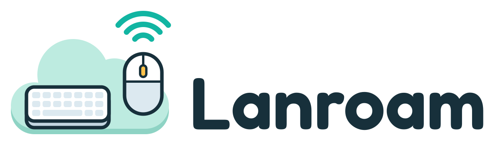

<h1 align="center">
  <picture>
    <source media="(prefers-color-scheme: dark)" srcset="./assets/logo-wordmark-dark.svg">
    
  </picture>
</h1>

<p align="center">
  One keyboard and mouse for every computer on your LAN — push the pointer off one screen, and it lands on the next.
</p>

<p align="center">
  <a href="https://github.com/zlx2019/lanroam/actions/workflows/ci.yml"></a>
  <a href="./LICENSE"></a>
  
</p>

<p align="center">
  <b>English</b> · <a href="./README.zh-CN.md">简体中文</a>
</p>

---

Every device running Lanroam becomes a peer on the local network. Your devices join one desk group, and their screens are laid out on a shared canvas the way they sit on your desk.

Arrange them once. From then on, move the pointer past the edge of one screen and it lands on the next computer, with the keyboard following along, carried device-to-device over a mutually authenticated TLS 1.3 channel. Lanroam is the third LAN tool in the family, after [Deskmate](https://github.com/zlx2019/deskmate) (file transfer) and [Lanecho](https://github.com/zlx2019/lanecho) (clipboard sync).

> 🚧 **Not released yet.** Everything on the roadmap below is done; the first release is on its way.

## ✨ Features

- 🖱️ **Edge crossing** — push the pointer past an edge your screen shares with another device and you control that device. Carry on across further devices and back, in any direction; positions map proportionally along the shared edges.
- 🎚️ **Crossing on your terms** — cross an edge right away, only while holding a modifier, or after a short dwell against it; a corner guard keeps the pointer home when you aim for a screen corner. Each edge can be closed or cross its own way.
- 🔀 **Mac ↔ Windows** — Command and Control swap places between a Mac and a PC, so shortcuts stay under the same fingers. The layout is in logical pixels, so a 150% Windows display lines up with a Mac's.
- 🧩 **Arrange screens** — the Arrange page shows the screens of every device in the group; drag them into place, and the whole group has the new layout. While it is open, the other devices show their numbers on their own screens.
- 📋 **The clipboard comes along** — copy on one device, move the pointer over and paste on the next; what you copy there comes back with you. Text, images and files: copied files up to 32 MB are fetched ahead as the pointer comes. What a password manager copies never leaves the device, and **Settings → Transfer** turns sharing or a kind off.
- 📁 **Drag files across** — hold files or folders in Finder or Explorer, drag them past the edge and drop them on the other computer: its desktop, a folder, or an app window. What lands is checked end to end; **Settings → Transfer** turns dragging off.
- ⌨️ **Hotkeys** — jump to a device by number or to the neighbour in a direction, lock the pointer to a device, or go home and pause crossing. Record your own combinations in the settings.
- 📌 **Keys that stay here** — combinations you keep local (switching input methods, screenshots) act on this computer even while you control another. Media and volume keys go to the device you control, or stay here.
- 🖲️ **Per-device pointer and wheel** — each device sets how fast the pointer and the wheel go on it, and can turn scrolling around for a Mac with natural scrolling.
- 💡 **Always know where you are** — the edge the pointer came in by lights up, a hint says when you pause, lock, jump or lose a device, and inactive screens can dim.
- ✋ **Take back any time** — type, click or move the mouse on a controlled device itself and control is back there at once; a mouse jolted or a touchpad brushed by accident does not count. A device that stops answering hands control back within 3 seconds.
- 🔗 **LAN P2P** — every device is an equal peer; no server, no cloud, no account.
- 📡 **Zero-config discovery** — mDNS with a UDP multicast fallback; nearby devices just show up.
- 🤝 **Join with a PIN** — a device joins the group by typing the 6-digit PIN a member shows, checked with a password-authenticated key exchange bound to both TLS certificates.
- 🔐 **Secure by default** — mutually authenticated TLS 1.3 over QUIC, with identities pinned to certificate fingerprints; input only ever reaches the members of your group.
- 🗂️ **Lives in the menu bar** — pause, lock or switch to a device from the menu bar (macOS) or the tray (Windows), and optionally start at login.

### Hotkeys

The defaults; record your own under **Settings → Control**. On a Mac, Alt is the Option key.

| Keys | Action |
|---|---|
| `Ctrl+Alt+1..9` | Jump to device n, numbered as the layout shows |
| `Ctrl+Alt+Arrow` | Jump to the neighbour in that direction |
| `Ctrl+Alt+L`, `Scroll Lock` | Lock the pointer to its device, or unlock |
| `Ctrl+Alt+Esc` | Back to this device and pause crossing, or resume |

The digits, arrows and L need the left Alt: on many layouts, AltGr (Ctrl+right Alt on Windows) types characters with them.

## 🗺️ Roadmap

| Milestone | Scope | Status |
|---|---|---|
| M0 | Shared LAN foundation, QUIC transport, integration CLI | ✅ |
| M1 | Input capture and injection (macOS ↔ Windows) | ✅ |
| M2 | Desk groups, screen layout, edge crossing, hotkeys | ✅ |
| M3 | Desktop app: screen arrangement, pairing, tray, settings | ✅ |
| M4 | Clipboard hand-off | ✅ |
| M5 | Drag and drop files between devices | ✅ |

## 📥 Install

Grab a build from [Releases](https://github.com/zlx2019/lanroam/releases) once the first one is out.

| Platform | Requires | Artifact |
|---|---|---|
| macOS (Apple Silicon) | macOS 13 Ventura or later | `Lanroam-x.y.z-macos-aarch64.dmg` |
| macOS (Intel) | macOS 13 Ventura or later | `Lanroam-x.y.z-macos-x64.dmg` |
| Windows | Windows 10 or later, x64 | `Lanroam-x.y.z-windows-x64-setup.exe` |

Each release carries the command-line node (`lanroam-cli`) too; see [CONTRIBUTING.md](./CONTRIBUTING.md#the-command-line-node).

### 🍎 macOS

Drag Lanroam into Applications. On first launch, it walks you through the **Accessibility** and **Input Monitoring** permissions it needs to capture and inject input.

### 🪟 Windows

The installer lets Lanroam through the firewall on private networks, which discovery and control need.

> Builds are not signed yet. On macOS, open the app with right-click → **Open** the first time (on macOS 15 and later: System Settings → Privacy & Security → **Open Anyway**), or run `xattr -cr /Applications/Lanroam.app`. Windows SmartScreen may ask for confirmation as well.

### 🧪 Development builds (Windows)

Every push builds the app (`Lanroam.exe`, portable) and the command-line node (`lanroam-cli.exe`) into the rolling [`dev` pre-release](https://github.com/zlx2019/lanroam/releases/tag/dev). Fetch the latest into `%LOCALAPPDATA%\Lanroam\dev` with:

```powershell
irm "https://raw.githubusercontent.com/zlx2019/lanroam/main/scripts/windows/update.ps1?$(Get-Random)" | iex
```

The first time, run it from an elevated PowerShell with `-Firewall`, which lets the LAN reach Lanroam:

```powershell
& ([scriptblock]::Create((irm "https://raw.githubusercontent.com/zlx2019/lanroam/main/scripts/windows/update.ps1?$(Get-Random)"))) -Firewall
```

## 🔒 Security

Lanroam forwards keystrokes and moves other computers' pointers, so the fine print matters:

- **Nothing leaves your LAN.** Input goes device-to-device over TLS 1.3, only to the members of your group. There is no server and no telemetry.
- **What you type travels.** While you control another device, every keystroke you type there, passwords included, crosses the network (encrypted).
- **Members trust each other fully.** Any member can control any other member, let new devices in and remove existing ones. Only join groups made of your own devices.
- **Joining takes the PIN.** The PIN is shown on a member's screen and checked with SPAKE2 bound to both certificate fingerprints: 3 attempts, then a 30-second cooldown. A device impersonating the one you picked learns nothing it could use.
- **Discovery is public on the LAN.** mDNS announces each device's name, ID, certificate fingerprint, platform, OS version and desk group ID in clear text.
- **The identity key is stored unencrypted** under `~/.lanroam`, readable only by your user account. Anyone with access to that account can impersonate the device.

See [SECURITY.md](./SECURITY.md) for the full list and how to report a vulnerability.

## ❓ FAQ

**The pointer stops at the edge of the Mac, or keys never reach the other device.**
Lanroam needs **Accessibility** and **Input Monitoring** under System Settings → Privacy & Security, and macOS applies them only after the app restarts (Lanroam offers to). When you use the CLI, it is your terminal that needs them.

**The permissions stopped working after an update (macOS).**
Builds are only ad-hoc signed for now, which ties the grants to the exact binary, so every new build invalidates them, and re-ticking the stale entry does nothing. Remove Lanroam from both lists, launch it again, grant the fresh entries, then restart Lanroam.

**Devices never show up on macOS.**
macOS 15+ asks for **Local Network** permission on first launch. It must be allowed, otherwise discovery fails silently. Re-enable it under System Settings → Privacy & Security → Local Network.

**Devices never show up on Windows.**
Discovery and control need an inbound firewall rule for private networks: the installer adds it (for a development build, run the update script once with `-Firewall` as shown above). Make sure Windows counts your network as **Private**, not Public.

**The pointer crosses at the wrong place, or not at all.**
The pointer only crosses where two screens touch in the layout. Open the **Arrange** page: the other devices show their numbers on their screens, so you can tell which is which; drag them to match your desk.

**Scrolling goes the wrong way on the other computer.**
A Mac with natural scrolling scrolls a PC the other way round. On the computer being controlled, turn on **Settings → Control → Reverse scrolling**; its scrolling speed is set there too.

**The volume keys change the other computer's volume.**
While you control another device, media and volume keys go there. To keep them on the computer in front of you, choose **Keep here** under **Settings → Control → Media keys**.

**A drag of files stops at the edge.**
Files cross only where the pointer can, and only between devices that both have dragging on (**Settings → Transfer**). A drag of anything else, such as selected text or a window, stays at the edge as before.

**A large drag of files won't drop into some apps.**
Until all its files are there, a drag carries a promise of them: it drops as soon as you let go, the files keep coming in the background (a card next to it shows how far they are, and its Cancel button stops them), and the pointer stays free. Only Finder, Explorer and the desktop take such a drop; let go on another app, such as a browser or a chat app, and the drag slides back with a hint to drop it on the desktop first (on Windows the cursor already says no over those apps). Drop it on the desktop or in a folder first, then drag it on from there. Small drags arrive as you cross and are not affected.

**Pasting gives what was on the clipboard before.**
Copied files come over in the background as the pointer arrives; a paste before they are there gives the older content, and a hint says when they are ready. Files over 32 MB are not fetched ahead: drag them over instead.

**Some windows ignore the mouse and keyboard.**
Secure input is out of reach: on Windows, the lock screen, UAC prompts and windows running as administrator cannot be controlled remotely; on macOS, secure input (password fields, terminals with Secure Keyboard Entry) stops the keyboard from being captured.

**Can the app and the CLI run at the same time?**
No. They share `~/.lanroam` and are the same device on the LAN; quit one before starting the other.

## 🔨 Build from source

The desktop app is Tauri 2 + React (`apps/desktop`), on a UI-free engine shared with the command-line node:

```text
deps/lan-kit        shared LAN foundation: identity, mutual TLS 1.3, discovery, framing
deps/lanroam-input  keyboard and mouse: capture, injection, key maps, edge switching
deps/lanroam-core   the engine: desk groups, QUIC transport, protocol, input sessions
deps/lanroam-cli    command-line node for protocol debugging and tests between machines
apps/desktop        the desktop app
```

Rust is pinned by `rust-toolchain.toml`; the app also needs Node 22+ and pnpm.

```bash
cd apps/desktop && pnpm install && pnpm tauri build  # the app for the current platform
cargo build --release -p lanroam-cli                 # the command-line node
```

## 🤝 Contributing

See [CONTRIBUTING.md](./CONTRIBUTING.md) for running the app and the CLI during development, the checks CI runs and the conventions. Please report security issues privately as described in [SECURITY.md](./SECURITY.md).

## 📄 License

[MIT](./LICENSE)
